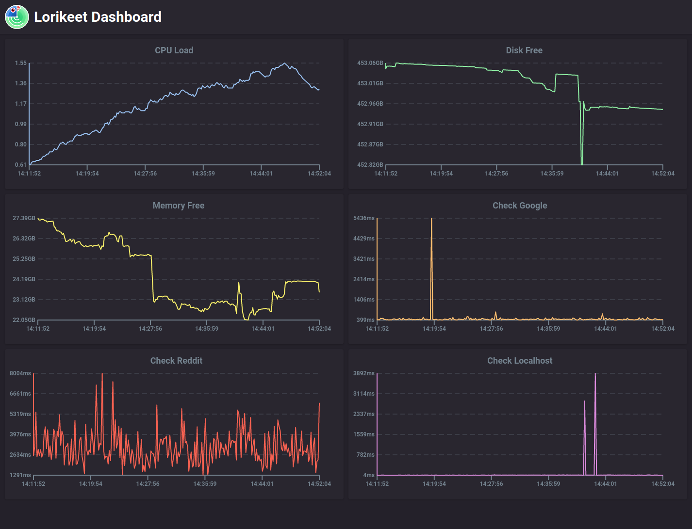

# Lorikeet Dashboard

A Web Dashboard for Lorikeet:




Takes the [lorikeet](https://github.com/cetra3/lorikeet) tests and turns them into a web dashboard.

## Usage

You can use your existing [lorikeet](https://github.com/cetra3/lorikeet) `test.yml` file:

```
lorikeet-dash test.yml
```

Navigate to [http://localhost:3333/](http://localhost:3333/) to view the dashboard.

### Command Line Options

You can use `lorikeet-dash -h` to get a list of options:

```
USAGE:
    lorikeet-dash [OPTIONS] [test-plan]

FLAGS:
    -h, --help       Prints help information
    -V, --version    Prints version information

OPTIONS:
    -c, --config <config>            Configuration File
    -l, --listen <listen>            Listen Address [default: 0.0.0.0:3333]
    -r, --refresh_ms <refresh-ms>    Refresh Interval [default: 10000]

ARGS:
    <test-plan>    Test Plan [default: test.yml]
```

## Installation

You can install it via `cargo`:

```
cargo install lorikeet-dash
```

### Frontend Development

Requires [NodeJS](https://nodejs.org/) & [Yarn](https://yarnpkg.com/)

You can run `yarn build` in the `front/` directory to build the frontend.

Alternatively, you can run `yarn start` in one window and `lorikeet-dash` in another to setup a dev environment.

the `dist` directory is included on master so that you don't need NodeJS to compile it down.
